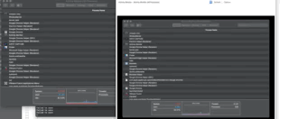

# AppShare Sample

AppShare Sample is an experiment for cross platform for appshare using nodejs and native C++ and respective apis (win32 and corefoundation/cocoa) for windows and mac.

## Installation

```bash
npm install
npm run rebuild
npm run start
```
## Demo
### Windows


### Mac OS X

{:height="700px" width="400px"}


## Current Issues
1. Cross platform c++ code can be cleaned up for make it truly reusable.
2. Build and packing.
3. The screen rendering needs improvement
4. mac is using hardcoded path instead of relying on the dlopen search path.


## License
[MIT](https://choosealicense.com/licenses/mit/)